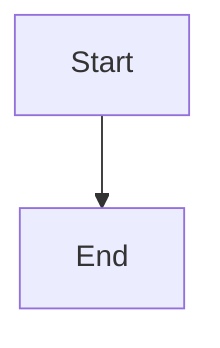

# Documentation Setup

This directory contains the documentation for KNIv2, configured for MkDocs with Material theme.

## 📖 MkDocs Setup

### 1. Connect to Read the Docs

1. Go to [readthedocs.org](https://readthedocs.org)
2. Sign in with your GitHub account
3. Click "Import a Project"
4. Select your KNIv2 repository
5. Configure the project:
   - **Name**: `kniv2` (or your preferred name)
   - **Repository**: `https://github.com/your-username/KNIv2`
   - **Default branch**: `main`
   - **Documentation type**: MkDocs
   - **Configuration file**: `mkdocs.yml`

### 2. Configure Custom Domain (Optional)

1. In your Read the Docs project settings
2. Go to "Domains"
3. Add your custom domain (e.g., `docs.yourdomain.com`)
4. Update the CNAME record in your DNS settings

### 3. Enable GitHub Pages (Alternative)

The documentation can also be served via GitHub Pages:

1. Go to your repository settings
2. Navigate to "Pages"
3. Select "GitHub Actions" as the source
4. The documentation will be built automatically on pushes to main

## 🔧 Local Development

### Prerequisites
```bash
pip install mkdocs mkdocs-material mkdocs-git-revision-date-localized-plugin mkdocs-git-committers-plugin-2 pymdown-extensions
```

### Build Documentation
```bash
# From project root
make docs-build
```

### Serve Documentation Locally
```bash
# From project root
make docs-serve
# Open http://localhost:8000 in your browser
```

### Clean Build Files
```bash
# From project root
make docs-clean
```

## 📁 Documentation Structure

```
docs/
├── index.md                    # Main documentation homepage
├── quick-start.md             # Quick start guide
├── workflow.md                # Development workflow
├── architecture.md            # System architecture
├── deployment.md              # Deployment guide
├── PRODUCTION_DEPLOYMENT.md   # Production setup
└── README.md                  # This file

mkdocs.yml                     # MkDocs configuration
requirements-docs.txt          # Documentation dependencies
```

## 🎨 Customization

### Adding New Pages
1. Create a new `.md` file in the `docs/` directory
2. Add it to the `nav` section in `mkdocs.yml`
3. Rebuild the documentation

### Custom Styling
The documentation uses the Material theme with custom configuration in `mkdocs.yml`.

### Extensions
The documentation uses several MkDocs extensions:
- `mkdocs-material` - Material Design theme
- `mkdocs-git-revision-date-localized-plugin` - Git revision dates
- `mkdocs-git-committers-plugin-2` - Git committers
- `pymdown-extensions` - Enhanced Markdown features

## 🚀 Deployment

### Automatic Deployment
- **Read the Docs**: Automatically builds on every push to main/staging
- **GitHub Pages**: Built via GitHub Actions workflow

### Manual Deployment
```bash
mkdocs build
# Upload site/ directory to your web server
```

## 🔍 Features

- **Search**: Full-text search across all documentation
- **Navigation**: Sidebar navigation with table of contents
- **Mobile Responsive**: Works on all devices
- **Code Highlighting**: Syntax highlighting for code blocks
- **Copy Buttons**: Easy copying of code examples
- **PDF Export**: Generate PDF versions of documentation
- **Version Control**: Support for multiple documentation versions
- **Dark/Light Mode**: Toggle between themes
- **Mermaid Diagrams**: Support for Mermaid diagrams

## 📝 Writing Guidelines

### Markdown Format
- Use standard Markdown syntax
- Include code examples with proper syntax highlighting
- Use admonitions for notes, warnings, and tips
- Keep line lengths under 80 characters for readability

### Structure
- Start with a clear title
- Include a table of contents for long documents
- Use consistent heading levels
- Add cross-references between related sections

### Code Examples
````bash
# Use language-specific code blocks
make dev
````

````python
# Python examples
def hello_world():
    print("Hello, World!")
````

### Admonitions
```markdown
!!! note "Note"
    This is a note.

!!! warning "Warning"
    This is a warning.

!!! tip "Tip"
    This is a tip.
```

### Mermaid Diagrams
````markdown

````

## 🐛 Troubleshooting

### Build Errors
- Check that all dependencies are installed
- Verify that all referenced files exist
- Check for syntax errors in Markdown files

### Read the Docs Issues
- Ensure `mkdocs.yml` is in the repository root
- Check that all dependencies are listed in `requirements-docs.txt`
- Verify that the build configuration is correct

### Local Build Issues
- Make sure you're in the project root directory
- Check that Python and pip are properly installed
- Try running `make docs-clean` before rebuilding

## 🎯 Benefits of MkDocs

- **Simple**: Easy to set up and maintain
- **Fast**: Quick builds and serving
- **Modern**: Material Design theme
- **Responsive**: Works on all devices
- **Search**: Built-in search functionality
- **Extensible**: Many plugins available
- **Git Integration**: Automatic revision dates and committers