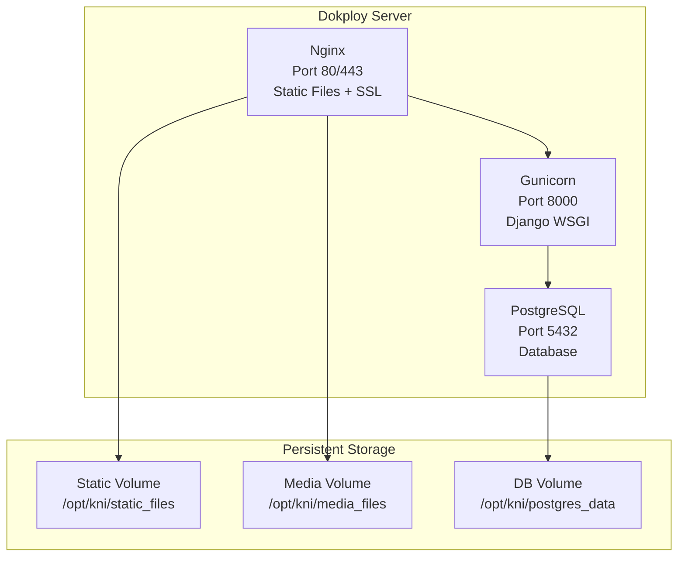
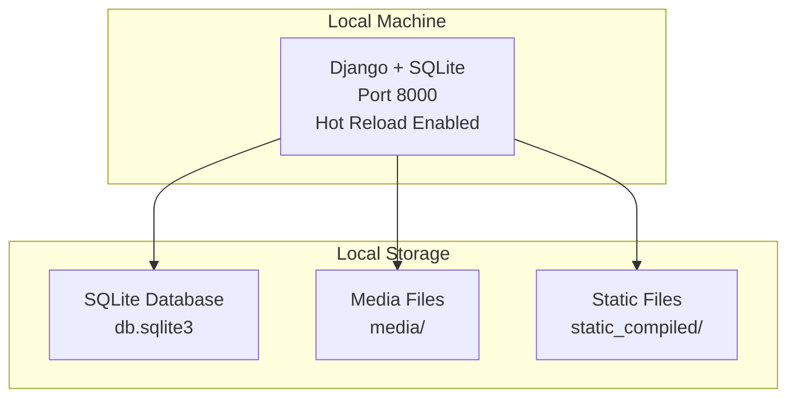

# Architecture

Understand the system architecture and technology stack for KNIv2.

## Production Architecture (Dokploy)



## Development Architecture



## Technology Stack

### Production Stack

| Component | Technology | Purpose |
|-----------|------------|---------|
| **Web Server** | Nginx | Static files, SSL/TLS, load balancing |
| **Application Server** | Gunicorn | WSGI server for Django |
| **Framework** | Django/Wagtail | CMS framework |
| **Database** | PostgreSQL | Production database |
| **Container Platform** | Dokploy | Deployment and orchestration |
| **Image Registry** | GitHub Container Registry | Docker image storage |

### Development Stack

| Component | Technology | Purpose |
|-----------|------------|---------|
| **Framework** | Django/Wagtail | CMS framework |
| **Database** | SQLite | Fast local development |
| **Static Files** | Django | Served by Django in development |
| **Hot Reload** | Django | Code changes reflected immediately |

## Environment Configuration

### Development Settings

```python
# KNI/settings/dev.py
DEBUG = True
DATABASES = {
    'default': {
        'ENGINE': 'django.db.backends.sqlite3',
        'NAME': BASE_DIR / 'db.sqlite3',
    }
}
STATIC_URL = '/static/'
MEDIA_URL = '/media/'
```

### Production Settings

```python
# KNI/settings/production.py
DEBUG = False
DATABASES = {
    'default': {
        'ENGINE': 'django.db.backends.postgresql',
        'NAME': os.environ.get('POSTGRES_DB', 'kni_db'),
        'USER': os.environ.get('POSTGRES_USER', 'kni_user'),
        'PASSWORD': os.environ.get('POSTGRES_PASSWORD'),
        'HOST': os.environ.get('POSTGRES_HOST', 'db'),
        'PORT': os.environ.get('POSTGRES_PORT', '5432'),
    }
}
STATIC_URL = '/static/'
MEDIA_URL = '/media/'
```

## Persistent Storage

### Database Persistence

| Environment | Storage | Location |
|-------------|---------|----------|
| **Development** | SQLite file | `db.sqlite3` |
| **Production** | PostgreSQL with Docker volume | `/opt/kni/postgres_data` |

### Media Files Persistence

| Environment | Storage | Location |
|-------------|---------|----------|
| **Development** | Local directory | `media/` |
| **Production** | Docker volume | `/opt/kni/media_files` |

### Static Files

| Environment | Storage | Location |
|-------------|---------|----------|
| **Development** | Built locally | `static_compiled/` |
| **Production** | Built during Docker build | Served by Nginx |

## Security & Best Practices

### Development Best Practices

:material-check:{ .green } **Always test with PostgreSQL** before pushing to staging  
:material-check:{ .green } **Use feature branches** for all development  
:material-check:{ .green } **Keep commits small and focused**  
:material-check:{ .green } **Write tests for new features**  
:material-check:{ .green } **Update documentation** when adding features  

### Deployment Best Practices

:material-check:{ .green } **Never build on production server** (use CI/CD)  
:material-check:{ .green } **Test staging environment** before production  
:material-check:{ .green } **Use health checks** for monitoring  
:material-check:{ .green } **Configure rollbacks** for failed deployments  
:material-check:{ .green } **Monitor application logs** regularly  

### Security Best Practices

:material-check:{ .green } **Use environment variables** for secrets  
:material-check:{ .green } **Enable HTTPS** in production  
:material-check:{ .green } **Regular security updates** for dependencies  
:material-check:{ .green } **Database backups** and encryption  
:material-check:{ .green } **Access control** and authentication  

## Health Monitoring

### Health Check Endpoint

```python
# KNI/urls.py
@require_http_methods(["GET"])
def health_check(request):
    """Health check endpoint for production monitoring"""
    return JsonResponse({
        "status": "healthy",
        "service": "kni_app",
        "version": "1.0.0"
    })
```

### Monitoring Configuration

```json
{
  "Test": [
    "CMD",
    "curl",
    "-f",
    "http://localhost:8000/health"
  ],
  "Interval": 30000000000,
  "Timeout": 10000000000,
  "StartPeriod": 30000000000,
  "Retries": 3
}
```

## Performance Considerations

### Static File Optimization

- **Nginx**: Serves static files with optimal caching
- **Compression**: Gzip compression for all static assets
- **CDN Ready**: Can be easily integrated with CDN

### Database Optimization

- **PostgreSQL**: Production-grade database with proper indexing
- **Connection Pooling**: Gunicorn handles database connections efficiently
- **Query Optimization**: Django ORM with proper database queries

### Caching Strategy

- **Static Files**: Cached by Nginx with long expiration
- **Database**: PostgreSQL query cache
- **Application**: Django cache framework ready for Redis

## Scalability

### Horizontal Scaling

- **Load Balancing**: Nginx can distribute traffic across multiple Django instances
- **Database**: PostgreSQL supports read replicas
- **Static Files**: Can be moved to CDN for global distribution

### Vertical Scaling

- **Docker**: Easy to increase container resources
- **Dokploy**: Simple resource scaling through interface
- **Database**: PostgreSQL can be scaled with more powerful hardware

## Next Steps

- [:material-arrow-right: Deployment](deployment.md) - Deploy to production
- [:material-arrow-right: Quick Start](quick-start.md) - Get started with development