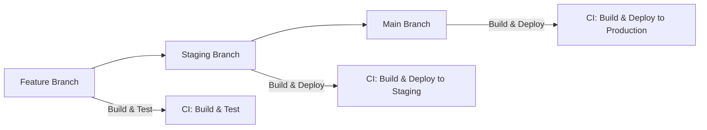

# Deployment

Deploy KNIv2 to production with Dokploy.

## CI/CD Pipeline



## Image Strategy

```
Feature Branch → Staging Branch → Main Branch
     ↓                ↓              ↓
   (no deploy)    (staging image)  (production image)
                      ↓              ↓
                   Staging Env    Production Env
```

**Images stored in**: GitHub Container Registry (`ghcr.io`)

## Dokploy Configuration

### Staging Application

| Setting | Value |
|---------|-------|
| **Source** | GitHub Container Registry |
| **Image** | `ghcr.io/your-username/kni-app:staging` |
| **Port** | 8000 |
| **Environment** | Production settings |
| **Volumes** | Staging storage |
| **Auto-deploy** | Enabled (on staging image updates) |

### Production Application

| Setting | Value |
|---------|-------|
| **Source** | GitHub Container Registry |
| **Image** | `ghcr.io/your-username/kni-app:latest` |
| **Port** | 8000 |
| **Environment** | Production settings |
| **Volumes** | Production storage |
| **Auto-deploy** | Enabled (on latest image updates) |

## Environment Variables

### Required Variables

```bash
# Required
SECRET_KEY=your-secret-key-here
ALLOWED_HOSTS=yourdomain.com,www.yourdomain.com
```

### Database Configuration

```bash
# Database (Production)
POSTGRES_DB=kni_db
POSTGRES_USER=kni_user
POSTGRES_PASSWORD=your-password
POSTGRES_HOST=db
POSTGRES_PORT=5432
```

### Optional Variables

```bash
# Optional
AWS_STORAGE_BUCKET_NAME=your-bucket
AWS_ACCESS_KEY_ID=your-key
AWS_SECRET_ACCESS_KEY=your-secret
```

## Health Checks and Monitoring

### Health Check Endpoint

```python
# KNI/urls.py
@require_http_methods(["GET"])
def health_check(request):
    """Health check endpoint for production monitoring"""
    return JsonResponse({
        "status": "healthy",
        "service": "kni_app",
        "version": "1.0.0"
    })
```

### Dokploy Health Check Configuration

```json
{
  "Test": [
    "CMD",
    "curl",
    "-f",
    "http://localhost:8000/health"
  ],
  "Interval": 30000000000,
  "Timeout": 10000000000,
  "StartPeriod": 30000000000,
  "Retries": 3
}
```

### Rollback Configuration

```json
{
  "Parallelism": 1,
  "Delay": 10000000000,
  "FailureAction": "rollback",
  "Order": "start-first"
}
```

## Deployment Process

### 1. Staging Deployment

```bash
# After PR approval and merge to staging
make git-staging
```

This triggers CI/CD:
- Builds image: `ghcr.io/your-username/kni-app:staging`
- Pushes to GitHub Container Registry
- Triggers Dokploy staging deployment
- Staging environment gets updated

### 2. Production Deployment

```bash
# Test staging environment
# If ready for production, merge staging to main
make git-release  # Enter version when prompted
```

This triggers CI/CD:
- Builds image: `ghcr.io/your-username/kni-app:latest`
- Pushes to GitHub Container Registry
- Triggers Dokploy production deployment
- Production environment gets updated
- Tags release: v1.2.0

## Docker Compose Configuration

### Production (`docker-compose.prod.yml`)

```yaml
version: '3.8'

services:
  web:
    image: ghcr.io/your-username/kni-app:latest
    ports:
      - "8000:8000"
    environment:
      - DJANGO_SETTINGS_MODULE=KNI.settings.production
    volumes:
      - static_volume:/app/static
      - media_volume:/app/media
    depends_on:
      - db
    command: gunicorn KNI.wsgi:application --bind 0.0.0.0:8000

  nginx:
    image: nginx:alpine
    ports:
      - "80:80"
      - "443:443"
    volumes:
      - static_volume:/app/static
      - media_volume:/app/media
      - ./nginx.conf:/etc/nginx/nginx.conf
    depends_on:
      - web

  db:
    image: postgres:15
    environment:
      POSTGRES_DB: kni_db
      POSTGRES_USER: kni_user
      POSTGRES_PASSWORD: kni_password
    volumes:
      - postgres_data:/var/lib/postgresql/data

volumes:
  static_volume:
  media_volume:
  postgres_data:
```

## Troubleshooting

### Common Issues

#### Development Issues

```bash
# Database migration issues
make dev-reset

# Static file issues
npm run build

# Dependency issues
pip install -r requirements.txt
npm install
```

#### Production Issues

```bash
# Check container logs
docker logs <container-name>

# Check health status
curl http://localhost:8000/health

# Restart services
docker-compose restart
```

### Monitoring Commands

```bash
# Check application status
curl -f http://localhost:8000/health

# View application logs
docker logs -f <container-name>

# Check resource usage
docker stats

# Inspect container
docker inspect <container-name>
```

## Support Resources

- [Django Deployment Documentation](https://docs.djangoproject.com/en/5.2/howto/deployment/)
- [Dokploy Documentation](https://docs.dokploy.com/docs/core/applications/going-production)
- [Docker Compose Documentation](https://docs.docker.com/compose/)

## Next Steps

- [:material-arrow-right: Production Setup](PRODUCTION_DEPLOYMENT.md) - Detailed production setup
- [:material-arrow-right: Architecture](architecture.md) - Understand the system design
- [:material-arrow-right: Workflow](workflow.md) - Learn the development process